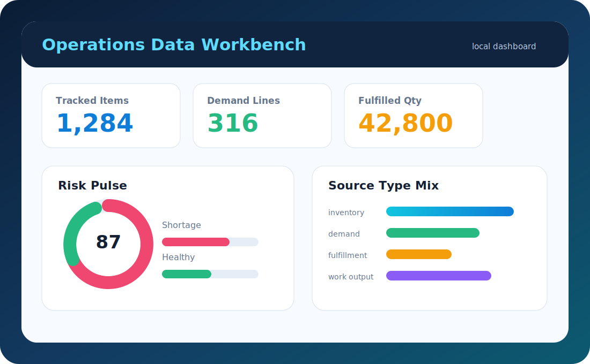
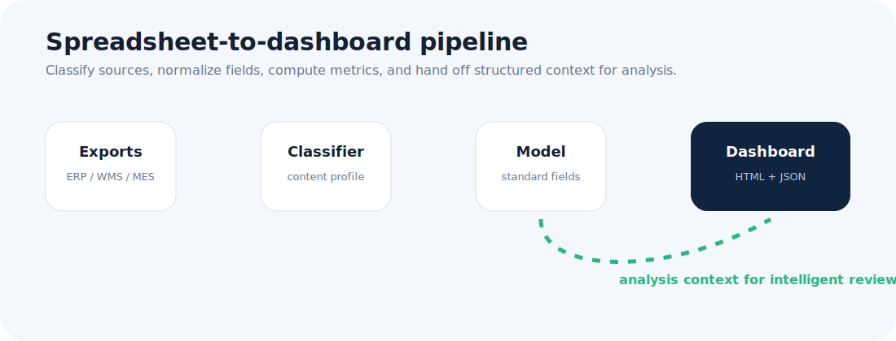
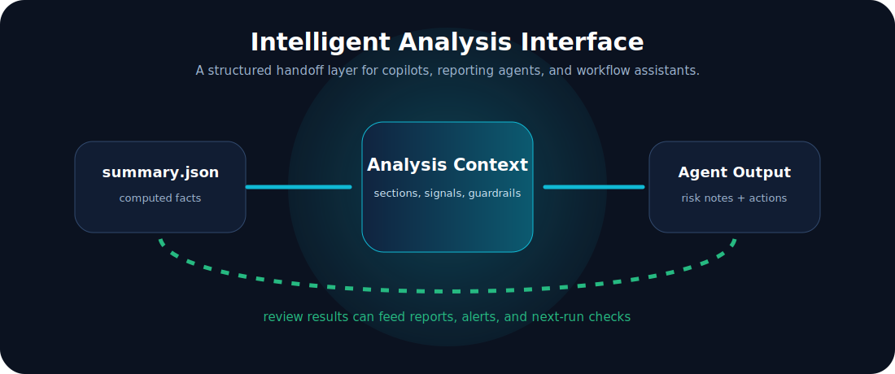

# Factory Excel Ops Dashboard

A local-first toolkit for turning manufacturing spreadsheet exports into a
clean inventory, shipment, purchase, production, and operations dashboard.

The project is designed for teams that still rely on Excel exports from WMS,
ERP, MES, order tracking, procurement, and production reports. It provides a
small but complete processing pipeline: classify files, map fields, normalize
records, compute operational summaries, and export a standalone dashboard.

## Highlights

- Classifies spreadsheet-like files by content, not just by file name.
- Maps common headers into a standard manufacturing data model.
- Ingests inventory, sales order, shipment, purchase, and production records.
- Computes operational summaries such as stock risk, order demand, shipment
  backlog, purchase plan volume, and production output.
- Exports a standalone HTML dashboard that can be opened locally.
- Provides an agent interface so automation tools can inspect capabilities and
  run the pipeline without reading project internals.

## Visual Overview







## Integration Direction

The current demo starts from local spreadsheet exports and keeps the processing
pipeline easy to run on a single workstation. The same contract can be extended
with ERP, WMS, MES, supplier, shipment, or reporting adapters by adding new file
signatures and field mappings.

For production deployments, adapters can be placed around the core pipeline:
source connectors feed standardized records into the engine, and reporting or
workflow layers consume the generated summaries, dashboards, and analysis
context.

## Quick Start

```powershell
py -m venv .venv
.\.venv\Scripts\python -m pip install -r requirements.txt
.\.venv\Scripts\python -m pip install -e .
.\.venv\Scripts\python -m factory_excel_ops.cli run --input sample_data --output output
```

If `py` is not available, use `python` instead.

Open the generated dashboard:

```powershell
start output\dashboard.html
```

For a quick Windows demo after installation:

```powershell
.\scripts\run_demo.cmd
```

## Agent Interface

Automation tools can inspect the project contract:

```powershell
python -m factory_excel_ops.cli agent-spec --output output\agent_interface.json
```

Generate structured context for an operations analysis assistant:

```powershell
python -m factory_excel_ops.cli analysis-context --summary output\summary.json --output output\analysis_context.json
```

The static interface file is also available at:

```text
agent_interface.json
```

## Bilingual Showcase

Open the overview page for a Chinese and English product explanation:

```powershell
start docs\showcase.html
```

## Packaging

Create a clean package for another workstation or an adapter build:

```powershell
python scripts\package_project.py --name factory-excel-ops-dashboard --output output
```

## Project Structure

```text
factory-excel-ops-dashboard/
  agent_interface.json     Machine-readable integration contract
  config/                 Example classification and field mapping config
  docs/                   Product overview and adapter notes
  sample_data/            Synthetic demo data only
  scripts/                Demo runner and clean package helper
  src/factory_excel_ops/  Reusable Python package
  tests/                  Regression tests for the public demo
```

## Data Flow


## Configuration

The project uses JSON configuration files:

- `config/sample_file_types.json` describes file type signatures.
- `config/sample_field_mapping.json` maps source headers to standard fields.

Teams can copy these files into their own adapter folder and replace the sample
signatures with their own workbook rules.

## Security and Privacy

Use demo or masked data for examples. Keep production exports, customer lists,
supplier lists, BOM files, shipment schedules, logs, and packaged executables
outside the source tree unless they are intentionally prepared as examples.

## License

MIT.
