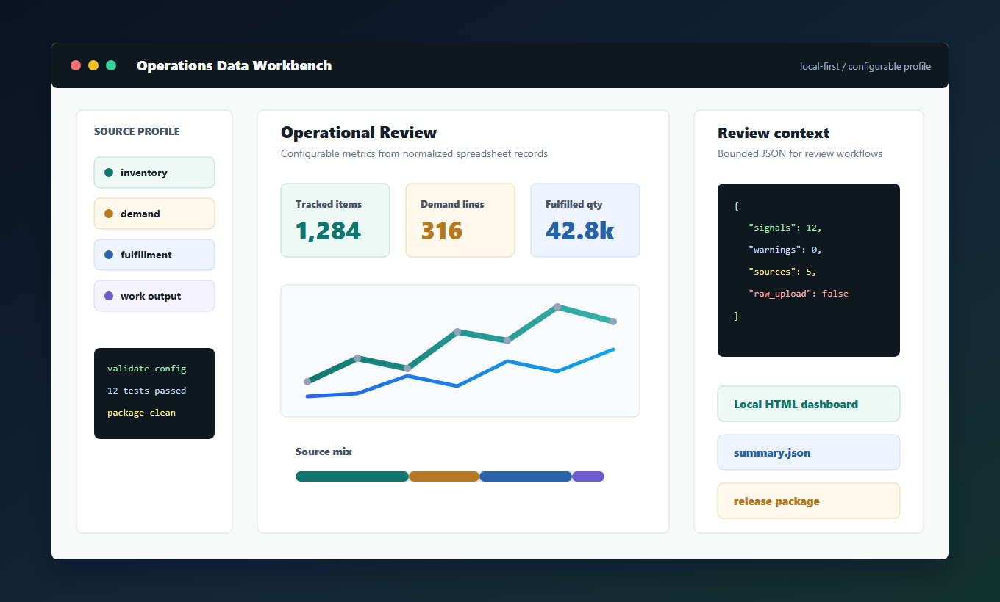

# Factory Excel Ops Dashboard

[](https://github.com/Felix-Zuo/factory-excel-ops-dashboard/actions/workflows/ci.yml)


[Product page](https://felix-zuo.github.io/factory-excel-ops-dashboard/showcase.html)
· [Architecture](docs/architecture.md)
· [Quality gates](docs/quality_gates.md)
· [Roadmap](docs/roadmap.md)



Local-first spreadsheet operations workbench for teams that still run critical
processes through Excel, CSV exports, shared folders, and manual reporting.

The project classifies incoming files, maps noisy headers into a standard data
model, computes configurable metrics, and exports a standalone HTML dashboard
plus JSON summaries for reporting and workflow handoff. It ships with generic
operations terminology and sample fixtures so it can be adapted beyond a single
factory, product line, or workbook template.

## What It Does

- Classifies spreadsheet-like files by content, not only by filename.
- Normalizes headers with case, spacing, separator, and unit noise.
- Supports configurable source types, field aliases, and metric profiles.
- Computes stock, demand, fulfillment, replenishment, and work-output metrics.
- Exports a local HTML dashboard and machine-readable `summary.json`.
- Provides an integration interface for reporting and workflow handoff.
- Keeps local adapters, real exports, logs, and generated packages outside Git.

## Data Boundary

The repository includes reusable code, sample fixtures, generic profiles,
tests, documentation, and packaging checks. Real exports, customer or supplier
records, BOMs, production logs, desktop binaries, internal deployment paths, and
company-specific adapter rules stay outside this repository.

## Quick Start

```powershell
py -m venv .venv
.\.venv\Scripts\python -m pip install -r requirements.txt
.\.venv\Scripts\python -m pip install -e .
.\.venv\Scripts\python -m factory_excel_ops.cli validate-config
.\.venv\Scripts\python -m factory_excel_ops.cli run --input sample_data --output output
```

If `py` is not available, use `python` instead.

Open the generated dashboard:

```powershell
start output\dashboard.html
```

For a quick Windows sample run after installation:

```powershell
.\scripts\run_sample.cmd
```

## Configuration Profile

The default profile is intentionally generic:

- `config/sample_file_types.json`: source signatures for `inventory`,
  `demand`, `fulfillment`, `replenishment`, and `work_output`.
- `config/sample_field_mapping.json`: header aliases such as `Item Code`,
  `Available Qty (EA)`, `Ship Qty`, and `Due-Date`.
- `config/sample_metrics.json`: metric definitions for dashboard cards and
  analysis context.

Run with a custom profile:

```powershell
python -m factory_excel_ops.cli run `
  --input sample_data `
  --output output `
  --file-types config\sample_file_types.json `
  --field-mapping config\sample_field_mapping.json `
  --metrics config\sample_metrics.json
```

## Integration Interface

Automation tools can inspect the project contract:

```powershell
python -m factory_excel_ops.cli integration-spec --output output\integration_interface.json
```

Generate structured context for an operations review workflow:

```powershell
python -m factory_excel_ops.cli analysis-context --summary output\summary.json --output output\analysis_context.json
```

The static interface file is also available at `integration_interface.json`.

## Validation

```powershell
python -m pytest -q
python -m factory_excel_ops.cli validate-config
python -m factory_excel_ops.cli run --input sample_data --output output
python -m factory_excel_ops.cli analysis-context --summary output\summary.json --output output\analysis_context.json
```

The test suite can run directly from a fresh checkout because `pyproject.toml`
adds `src` to the pytest import path.

## Product Materials

- [Evolution notes](docs/product_evolution.md)
- [Architecture](docs/architecture.md)
- [Configuration cookbook](docs/configuration_cookbook.md)
- [Data safety checklist](docs/data_safety_checklist.md)
- [Quality gates](docs/quality_gates.md)
- [Threat model](docs/threat_model.md)
- [GitHub maintenance](docs/github_maintenance.md)
- [Roadmap](docs/roadmap.md)
- [Product page benchmark](docs/showcase_design_benchmark.md)
- [Adapter integration guide](docs/adapter_integration_guide.md)
- [Integration interface guide](docs/integration_interface.md)
- [Product page](docs/showcase.html)

## Project Structure

```text
factory-excel-ops-dashboard/
  integration_interface.json Machine-readable integration contract
  config/                 Example source, field, and metric profiles
  docs/                   Product, adapter, architecture, and safety notes
  sample_data/            Sample fixture data only
  scripts/                Demo runner and clean package helper
  src/factory_excel_ops/  Reusable Python package
  tests/                  Regression tests for the sample workflow
```

## Packaging

Create a clean package for another workstation or adapter build:

```powershell
python scripts\package_project.py --name factory-excel-ops-dashboard --output output
```

Generated packages belong in `output/` or another ignored folder.

## Current Version

`0.2.2` refines the integration surface, upgrades the product page, and keeps
the release package boundary focused on reusable source, sample fixtures,
documentation, and validation gates.

## License

MIT.
