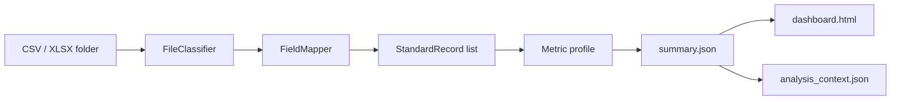

# Architecture

Factory Excel Ops Dashboard is intentionally small. The core package should
remain reusable while local projects add adapters around it.

## Pipeline

## Core Modules

| Module | Responsibility |
| --- | --- |
| `io.py` | Read CSV and first-sheet XLSX/XLSM tables. |
| `classifier.py` | Score files with configured headers, values, and filename hints. |
| `field_mapper.py` | Normalize raw headers into standard fields. |
| `ingest.py` | Convert classified rows into `StandardRecord` objects. |
| `metrics.py` | Execute configurable metric specs. |
| `dashboard.py` | Export a standalone local HTML dashboard. |
| `analysis_context.py` | Build a bounded context payload for reporting workflows. |
| `integration_interface.py` | Expose a machine-readable integration contract. |

## Config Contract

The default profile is composed of three JSON files:

| File | Purpose |
| --- | --- |
| `config/sample_file_types.json` | Source type signatures. |
| `config/sample_field_mapping.json` | Raw header aliases. |
| `config/sample_metrics.json` | Dashboard and summary metric definitions. |

Local deployments should copy these files into an adapter repository or local
ignored folder, then run the CLI with explicit config paths.

## Metric Types

Supported metric types:

- `sum`: sum one normalized numeric field.
- `count`: count records for a source filter.
- `distinct_count`: count distinct non-empty values in a field.
- `count_group_lte`: group records, sum a value field, and count groups below
  or equal to a threshold.
- `count_group_gte`: group records, sum a value field, and count groups above
  or equal to a threshold.

The engine accepts `source_type` as a string, list, or omitted value. Omitted
source types apply to all records.

## Data Boundary

The package reads local files and writes local outputs. It does not upload data
or call remote services. Generated files should be written to `output/` or
another ignored location.

## Extension Boundaries

Good extensions:

- New config profiles.
- New safe metric types with tests.
- Better local readers with explicit file limits.
- Additional generated artifacts based on `summary.json`.

Avoid in the reusable core:

- Company-specific workbook names.
- Customer or supplier logic.
- Hard-coded source fields from one internal workflow.
- Direct network uploads.
- Desktop binaries or bundled runtimes.
